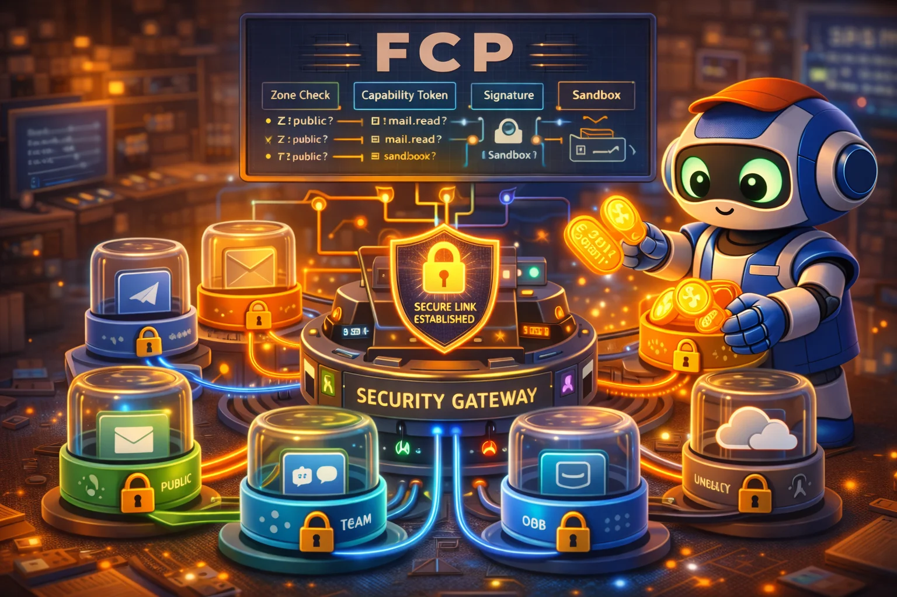

# Flywheel Connector Protocol (FCP)

<div align="center">
  
</div>

A mesh-native protocol for secure, distributed AI assistant operations across personal device meshes — plus a growing library of production-ready Rust connectors implementing that protocol.

---

## TL;DR

**This project is two things:**

1. **The FCP Protocol** — A mesh-native specification for how AI agents securely interact with external services through zone-isolated, capability-gated connectors distributed across your personal device mesh

2. **Connector Implementations** — Production Rust binaries for Twitter, Linear, Stripe, Telegram, Discord, Gmail, GitHub, browser automation, and more

**The Vision**: Your personal AI runs on YOUR devices. Your data exists as symbols across YOUR mesh. Any subset of YOUR devices can reconstruct anything. Computation happens wherever optimal. Secrets are never complete anywhere. History is tamper-evident by construction.

**This is not a cloud alternative. This is digital sovereignty.**

### Three Foundational Axioms

| Axiom | Principle |
|-------|-----------|
| **Universal Fungibility** | All data flows as RaptorQ symbols. Any K' symbols reconstruct the original. No symbol is special. |
| **Authenticated Mesh** | Tailscale IS the transport AND the identity layer. Every node has unforgeable WireGuard keys. |
| **Explicit Authority** | No ambient authority. All capabilities flow from owner key through cryptographic chains. |

### Why Use FCP?

| Feature | What It Does |
|---------|--------------|
| **Mesh-Native Architecture** | Every device IS the Hub. No central coordinator. |
| **Symbol-First Protocol** | RaptorQ fountain codes enable multipath aggregation and offline resilience |
| **Zone Isolation** | Cryptographic namespaces with Tailscale ACL enforcement |
| **Capability Tokens** | Cryptographically-scoped authorization for every operation |
| **Threshold Secrets** | Secrets distributed as k-of-n across devices—never complete anywhere |
| **Computation Migration** | Operations execute on the optimal device automatically |
| **Offline Access** | Reduced probability, not binary unavailability |
| **Agent-Native Design** | Every operation is introspectable, typed, and has recovery hints |

### Quick Example

```
┌─────────────────────────────────────────────────────────────────────────┐
│                           PERSONAL MESH                                  │
├─────────────────────────────────────────────────────────────────────────┤
│                                                                          │
│   ┌──────────┐      ┌──────────┐      ┌──────────┐                      │
│   │ Desktop  │◄────►│  Laptop  │◄────►│  Phone   │  ← Tailscale mesh    │
│   │ MeshNode │      │ MeshNode │      │ MeshNode │                      │
│   └────┬─────┘      └────┬─────┘      └────┬─────┘                      │
│        │                 │                 │                             │
│        ▼                 ▼                 ▼                             │
│   ┌─────────────────────────────────────────────────────────────────┐   │
│   │                    SYMBOL DISTRIBUTION                           │   │
│   │  Object: gmail-inbox-2026-01   K=100 symbols distributed        │   │
│   │  Desktop: [1,5,12,23,...]  Laptop: [2,8,15,...]  Phone: [3,9,...]│   │
│   │  Any 100 symbols → full reconstruction                          │   │
│   └─────────────────────────────────────────────────────────────────┘   │
│                                                                          │
│   Agent Request                                                          │
│       │                                                                  │
│       ▼                                                                  │
│   ┌─────────────┐     ┌─────────────┐     ┌─────────────┐               │
│   │ Zone Check  │────►│  Cap Check  │────►│  Connector  │               │
│   │ z:private?  │     │ gmail.read? │     │   Gmail     │               │
│   │ (crypto+ACL)│     │ (signed)    │     │ (sandboxed) │               │
│   └─────────────┘     └─────────────┘     └─────────────┘               │
│                                                  │                       │
│                                                  ▼                       │
│                                           Gmail API                      │
│                                                                          │
└─────────────────────────────────────────────────────────────────────────┘
```

---

## Origins & Motivation

This project emerged from the Agent Flywheel ecosystem, where AI coding agents coordinate across multiple external services. Existing approaches to multi-service integration suffer from critical security flaws:

1. **Trust Commingling**: A message from a public Discord channel could trigger operations on private Gmail
2. **Prompt-Based Security**: "Don't read private emails" is trivially bypassed by prompt injection
3. **Centralized Architecture**: Single points of failure, cloud dependency, vendor lock-in
4. **Binary Offline**: No connectivity = no access

FCP V2 addresses these through:
- **Zones as cryptographic universes**—if the Gmail-read capability doesn't exist in a zone, it cannot be invoked, regardless of what an agent says
- **Mesh-native architecture**—your devices collectively ARE the system
- **Symbol-first protocol**—data availability is probabilistic, not binary

---

## FCP V1 vs V2

| Aspect | V1 (Hub-Spoke) | V2 (Mesh-Native) |
|--------|----------------|-------------------|
| Architecture | Central Hub process | Mesh IS the Hub |
| Connectors | On specific machines | Capabilities anywhere |
| Sessions | Per-node | Mesh-wide contexts |
| Storage | Device-local | Symbol distribution |
| Offline | No access | Reduced probability |
| Identity | Per-service principals | Tailscale identity |
| Zones | Policy enforcement | Tailscale tags + crypto |
| Secrets | On devices | Threshold secrets (k-of-n) |
| Execution | Fixed location | Optimal device selection |
| Protocol | Connection-oriented | Symbol-oriented |

---

## Core Concepts

### Terminology

| Term | Definition |
|------|------------|
| **Symbol** | A RaptorQ-encoded fragment; any K' symbols reconstruct the original |
| **Object** | Content-addressed data identified by ObjectId |
| **Zone** | A cryptographic namespace with its own encryption key |
| **Epoch** | A logical time unit; no ordering within, ordering between |
| **MeshNode** | A device participating in the FCP mesh |
| **Capability** | An authorized operation with cryptographic proof |
| **Connector** | A sandboxed binary that bridges external services to FCP |
| **Manifest** | Embedded metadata describing connector properties |
| **FCT (Flywheel Capability Token)** | Cryptographically-scoped authorization for operations |
| **Principal** | An identity (user, agent, or service) making requests |
| **Hub** | Legacy term; in FCP V2, the mesh collectively IS the Hub |

### Security Invariants

These are **hard requirements** that FCP enforces mechanically:

1. **Single-Zone Binding**: A connector instance MUST bind to exactly one zone for its lifetime
2. **Default Deny**: If a capability is not explicitly granted to a zone, it MUST be impossible to invoke
3. **No Cross-Connector Calling**: Connectors MUST NOT call other connectors directly; all composition happens through the mesh
4. **No Credential Custody by Mesh**: The mesh MUST NOT store raw OAuth tokens or API keys; connectors manage their own credentials
5. **Threshold Secret Distribution**: Secrets MUST be distributed as k-of-n symbols—never complete on any single device
6. **Auditable Everything**: Every operation invocation MUST produce auditable records with correlation IDs
7. **Cryptographic Authority Chain**: All authority flows from owner key through verifiable signature chains

---

## Zone Architecture

Zones are **cryptographic boundaries**, not labels. Each zone has its own encryption key derived from the owner key.

### Zone Hierarchy with Tailscale Mapping

```
z:owner        [Trust: 100]  Direct owner control, most privileged
    │                        Tailscale tag: tag:fcp-owner
    ▼
z:private      [Trust: 80]   Personal data, high sensitivity
    │                        Tailscale tag: tag:fcp-private
    ▼
z:work         [Trust: 60]   Professional context, medium sensitivity
    │                        Tailscale tag: tag:fcp-work
    ▼
z:community    [Trust: 40]   Trusted external (paired users)
    │                        Tailscale tag: tag:fcp-community
    ▼
z:public       [Trust: 20]   Public/anonymous inputs
                             Tailscale tag: tag:fcp-public

INVARIANT: Data can flow DOWN (higher → lower trust) freely.
           Data flowing UP requires explicit elevation + approval.
```

### Defense-in-Depth

```
Layer 1: Tailscale ACLs     → Network-level isolation
Layer 2: Zone Encryption    → Cryptographic isolation
Layer 3: Policy Objects     → Authority isolation
Layer 4: Capability Signing → Operation isolation
```

### Zone Rules

| Rule | Enforcement |
|------|-------------|
| Single-zone binding | Connector receives zone at startup; cannot change |
| Capability ceiling | Mesh rejects capability grants exceeding zone ceiling |
| Data flow | Cross-zone data blocked unless explicitly allowed |
| Principal filtering | Zone defines which principals can access it |
| Tailscale ACL sync | Zone policies generate Tailscale ACL rules |

---

## Connector Archetypes

FCP defines 10 fundamental data flow patterns. Each connector implements one or more archetypes.

```
┌─────────────────────────────────────────────────────────────────────────────┐
│                        FCP CONNECTOR ARCHETYPES                              │
├─────────────────────────────────────────────────────────────────────────────┤
│                                                                              │
│  ┌─────────────────┐  ┌─────────────────┐  ┌─────────────────┐              │
│  │ REQUEST-RESPONSE│  │    STREAMING    │  │  BIDIRECTIONAL  │              │
│  │                 │  │                 │  │                 │              │
│  │   Agent ──────► │  │   Agent ◄───── │  │   Agent ◄─────► │              │
│  │          ◄───── │  │         Server  │  │          Server │              │
│  │         Service │  │                 │  │                 │              │
│  │                 │  │                 │  │                 │              │
│  │ Examples:       │  │ Examples:       │  │ Examples:       │              │
│  │ • REST APIs     │  │ • WebSocket     │  │ • Chat protocols│              │
│  │ • GraphQL       │  │ • SSE           │  │ • Collaborative │              │
│  │ • gRPC unary    │  │ • Log tailing   │  │ • Game state    │              │
│  └─────────────────┘  └─────────────────┘  └─────────────────┘              │
│                                                                              │
│  ┌─────────────────┐  ┌─────────────────┐  ┌─────────────────┐              │
│  │     POLLING     │  │     WEBHOOK     │  │   QUEUE/PUBSUB  │              │
│  │                 │  │                 │  │                 │              │
│  │   Agent ──────► │  │   Agent ◄───── │  │   Agent ◄─────► │              │
│  │   (periodic)    │  │    (push)       │  │          Broker │              │
│  │         Service │  │         Service │  │                 │              │
│  │                 │  │                 │  │                 │              │
│  │ Examples:       │  │ Examples:       │  │ Examples:       │              │
│  │ • Email (IMAP)  │  │ • GitHub hooks  │  │ • Redis Pub/Sub │              │
│  │ • RSS feeds     │  │ • Stripe events │  │ • NATS          │              │
│  │ • Status checks │  │ • Slack events  │  │ • Kafka         │              │
│  └─────────────────┘  └─────────────────┘  └─────────────────┘              │
│                                                                              │
│  ┌─────────────────┐  ┌─────────────────┐  ┌─────────────────┐              │
│  │   FILE/BLOB     │  │ DATABASE/QUERY  │  │  CLI/PROCESS    │              │
│  │                 │  │                 │  │                 │              │
│  │   Agent ──────► │  │   Agent ──────► │  │   Agent ──────► │              │
│  │   (upload/dl)   │  │   (query)       │  │   (spawn)       │              │
│  │         Storage │  │         DB      │  │         Process │              │
│  │                 │  │                 │  │                 │              │
│  │ Examples:       │  │ Examples:       │  │ Examples:       │              │
│  │ • S3            │  │ • PostgreSQL    │  │ • git           │              │
│  │ • GCS           │  │ • Vector DBs    │  │ • kubectl       │              │
│  │ • Local FS      │  │ • Elasticsearch │  │ • terraform     │              │
│  └─────────────────┘  └─────────────────┘  └─────────────────┘              │
│                                                                              │
│  ┌─────────────────┐                                                         │
│  │    BROWSER      │  ← Combines multiple patterns                           │
│  │   AUTOMATION    │                                                         │
│  │                 │                                                         │
│  │   Agent ──────► │                                                         │
│  │   (CDP)         │                                                         │
│  │         Browser │                                                         │
│  └─────────────────┘                                                         │
│                                                                              │
└─────────────────────────────────────────────────────────────────────────────┘
```

### Archetype Selection Guide

| Use Case | Primary Archetype | Secondary |
|----------|-------------------|-----------|
| REST API integration | Request-Response | — |
| Real-time chat (Telegram, Discord) | Bidirectional | Webhook |
| Email inbox monitoring | Polling | Request-Response |
| GitHub/Stripe webhooks | Webhook | — |
| S3/GCS file operations | File/Blob | — |
| Database queries | Database | — |
| Running git/kubectl | CLI/Process | — |
| Message queue processing | Queue/Pub-Sub | — |
| Web scraping | Browser | Request-Response |

---

## Symbol Layer

All data in FCP V2 flows as RaptorQ fountain-coded symbols.

### Why Symbols?

```
Traditional Approach:
  File: 100KB → Must transfer complete file
  Lost packet → Retransmit specific data
  Single path → Bandwidth limited

Symbol Approach:
  File: 100KB → 100 symbols (1KB each)
  Any 100 symbols → Full reconstruction
  No symbol is special → No retransmit coordination
  Multipath aggregation → Symbols from any source contribute equally
```

### Symbol Properties

| Property | Benefit |
|----------|---------|
| **Fungibility** | Any K' symbols reconstruct; no coordination needed |
| **Multipath** | Aggregate bandwidth across all network paths |
| **Resumable** | No bookkeeping; just collect more symbols |
| **DoS Resistant** | Attackers can't target "important" symbols |
| **Offline Resilient** | Partial availability = partial reconstruction |

### Frame Format (FCPS)

```
┌─────────────────────────────────────────────────────────────────────────────┐
│                       FCPS FRAME FORMAT (Symbol-Native)                      │
├─────────────────────────────────────────────────────────────────────────────┤
│                                                                             │
│  Bytes 0-3:    Magic (0x46 0x43 0x50 0x53 = "FCPS")                         │
│  Bytes 4-5:    Version (u16 LE)                                             │
│  Bytes 6-7:    Flags (u16 LE)                                               │
│  Bytes 8-11:   Symbol Count (u32 LE)                                        │
│  Bytes 12-15:  Total Payload Length (u32 LE)                                │
│  Bytes 16-47:  Object ID (32 bytes)                                         │
│  Bytes 48-63:  Zone ID hash (16 bytes)                                      │
│  Bytes 64-71:  Epoch ID (u64 LE)                                            │
│  Bytes 72+:    Symbol payloads (encrypted, concatenated)                    │
│  Final 8:      Checksum (XXH3-64)                                           │
│                                                                             │
└─────────────────────────────────────────────────────────────────────────────┘
```

---

## Mesh Architecture

Every device is a MeshNode—collectively, they ARE the Hub.

### MeshNode Capabilities

```
┌─────────────────────────────────────────────────────────────────────────────┐
│                              MESHNODE                                        │
├─────────────────────────────────────────────────────────────────────────────┤
│                                                                              │
│  ┌─────────────────────────────────────────────────────────────────────┐    │
│  │  Tailscale Identity                                                  │    │
│  │  • Stable node ID (unforgeable WireGuard keys)                      │    │
│  │  • Automatic peer discovery                                          │    │
│  │  • ACL tags for zone mapping                                         │    │
│  └─────────────────────────────────────────────────────────────────────┘    │
│                                                                              │
│  ┌─────────────────────────────────────────────────────────────────────┐    │
│  │  Symbol Store                                                        │    │
│  │  • Local symbol storage                                              │    │
│  │  • Gossip layer for discovery                                        │    │
│  │  • Bloom filters for efficient queries                               │    │
│  └─────────────────────────────────────────────────────────────────────┘    │
│                                                                              │
│  ┌─────────────────────────────────────────────────────────────────────┐    │
│  │  Capability Registry                                                 │    │
│  │  • Zone keys for encryption/decryption                               │    │
│  │  • Trust anchors (owner key, known keys)                             │    │
│  │  • Capability verification                                           │    │
│  └─────────────────────────────────────────────────────────────────────┘    │
│                                                                              │
│  ┌─────────────────────────────────────────────────────────────────────┐    │
│  │  Execution Planner                                                   │    │
│  │  • Device profiles (CPU, GPU, memory, battery)                       │    │
│  │  • Placement policies                                                │    │
│  │  • Computation migration                                             │    │
│  └─────────────────────────────────────────────────────────────────────┘    │
│                                                                              │
└─────────────────────────────────────────────────────────────────────────────┘
```

### Transport Priority

```
Priority 1: Tailscale Direct (same LAN)     - <1ms, z:owner OK
Priority 2: Tailscale Mesh (NAT traversal)  - 10-100ms, z:owner OK
Priority 3: Tailscale DERP Relay            - 50-200ms, z:private and below
Priority 4: Tailscale Funnel (public)       - Variable, z:community/public only
```

---

## Connector Binary Structure

Every FCP connector is a single executable with embedded metadata:

```
┌────────────────────────────────────────────────────────────────┐
│                        FCP BINARY                               │
├────────────────────────────────────────────────────────────────┤
│  ┌──────────────────────────────────────────────────────────┐  │
│  │                    MANIFEST SECTION                       │  │
│  │  ┌─────────────────┐  ┌─────────────────┐                │  │
│  │  │  Metadata       │  │  Capabilities   │                │  │
│  │  │  - Name         │  │  - Required     │                │  │
│  │  │  - Version      │  │  - Optional     │                │  │
│  │  │  - Author       │  │  - Forbidden    │                │  │
│  │  │  - License      │  │                 │                │  │
│  │  └─────────────────┘  └─────────────────┘                │  │
│  │  ┌─────────────────┐  ┌─────────────────┐                │  │
│  │  │  Zone Policy    │  │  Config Schema  │                │  │
│  │  │  - Home zone    │  │  - JSON Schema  │                │  │
│  │  │  - Allowed      │  │  - Defaults     │                │  │
│  │  │  - Tailscale tag│  │  - Secrets ref  │                │  │
│  │  └─────────────────┘  └─────────────────┘                │  │
│  │  ┌─────────────────┐                                      │  │
│  │  │  AI Hints       │  ← Agent-readable operation docs     │  │
│  │  │  - Operations   │                                      │  │
│  │  │  - Examples     │                                      │  │
│  │  │  - Safety notes │                                      │  │
│  │  └─────────────────┘                                      │  │
│  └──────────────────────────────────────────────────────────┘  │
│  ┌──────────────────────────────────────────────────────────┐  │
│  │                    CODE SECTION                           │  │
│  │  - FCP protocol implementation                            │  │
│  │  - Capability negotiation                                 │  │
│  │  - External API clients                                   │  │
│  │  - State management                                       │  │
│  └──────────────────────────────────────────────────────────┘  │
│  ┌──────────────────────────────────────────────────────────┐  │
│  │                   SIGNATURE SECTION                       │  │
│  │  - Ed25519 signature over manifest + code                 │  │
│  │  - Reproducible build attestation                         │  │
│  │  - Registry provenance chain                              │  │
│  └──────────────────────────────────────────────────────────┘  │
└────────────────────────────────────────────────────────────────┘
```

---

## Security Model

### Threat Model

FCP defends against:

| Threat | Mitigation |
|--------|------------|
| Compromised device | Threshold secrets, source diversity, Byzantine model (f < n/3) |
| Malicious connector binary | Ed25519 signature verification, sandboxing |
| Compromised external service | Zone isolation, capability limits |
| Prompt injection via messages | Protocol-level filtering, taint tracking, no code execution |
| Privilege escalation | Static capability allocation, no runtime grants |
| Side-channel leaks | Memory isolation, timing-safe operations |
| Supply chain attacks | Reproducible builds, provenance attestation |
| Replay attacks | Epoch binding, nonce verification |

### Taint Tracking

Every piece of data carries its origin (provenance):

```
TaintLevel::Untainted    → Owner-generated, can do anything
TaintLevel::Tainted      → Trusted external, policy-based restrictions
TaintLevel::HighlyTainted → Public/anonymous, dangerous operations blocked

Rule: Tainted data invoking risky operations in higher-trust zones
      requires explicit elevation token from approver.
```

### Threshold Secrets

Secrets are distributed as k-of-n symbols across devices:

```
Secret: API_KEY
Distribution: 3-of-5 across [Desktop, Laptop, Phone, Tablet, Server]

Desktop: [symbol_1, symbol_3]
Laptop:  [symbol_2, symbol_4]
Phone:   [symbol_5]

To use secret: Collect any 3 symbols → reconstruct → use → zeroize
No single device ever has the complete secret.
```

### Secret Lifecycle

```
1. PROVISIONING
   User → Mesh (seal) → Distribute as k-of-n symbols

2. RECONSTRUCTION
   Collect k symbols → Reconstruct in secure memory

3. USAGE
   - Secrets exist only in memory
   - Never logged, never serialized
   - Zeroized after use

4. ROTATION
   - Automatic per schedule
   - Re-distribute new symbols
   - Revoke old symbols
```

---

## Connectors

### Tier 1: Critical Infrastructure (Build First)

These unlock entire categories of autonomous agent work.

| Connector | Value | Archetype | Why Critical |
|-----------|-------|-----------|--------------|
| `fcp.twitter` | 98 | Request-Response + Streaming | Real-time information layer; social listening, posting, DMs |
| `fcp.linear` | 97 | Request-Response + Webhook | Human↔agent task handoff; bi-directional Beads sync |
| `fcp.stripe` | 96 | Request-Response + Webhook | Financial operations; invoicing, subscriptions, analytics |
| `fcp.youtube` | 95 | Request-Response | Video transcripts, channel analytics, content research |
| `fcp.browser` | 95 | Browser Automation | Universal adapter for any web service without API |
| `fcp.telegram` | 94 | Bidirectional + Webhook | Real-time messaging, bot automation |
| `fcp.discord` | 93 | Bidirectional + Webhook | Community management, server automation |

### Tier 2: Productivity & Workspace

| Connector | Archetype | Use Case |
|-----------|-----------|----------|
| `fcp.gmail` | Polling + Request-Response | Email automation, inbox management |
| `fcp.google_calendar` | Request-Response + Polling | Scheduling, availability |
| `fcp.notion` | Request-Response | Knowledge base, documentation |
| `fcp.github` | Request-Response + Webhook | Code review, issue management, CI/CD |
| `fcp.slack` | Bidirectional | Team communication |

### Tier 3: Infrastructure & Data

| Connector | Archetype | Use Case |
|-----------|-----------|----------|
| `fcp.s3` | File/Blob | Cloud storage operations |
| `fcp.postgresql` | Database | Direct database queries |
| `fcp.elasticsearch` | Database | Search and analytics |
| `fcp.redis` | Queue/Pub-Sub | Caching, message queues |
| `fcp.whisper` | CLI/Process | Voice transcription |

---

## Performance Targets

| Metric | Target | Enforcement |
|--------|--------|-------------|
| Cold start | < 50ms | Binary preloading |
| Message latency | < 1ms | Zero-copy IPC |
| Memory overhead | < 10MB per connector | Static allocation |
| CPU overhead | < 1% idle | Event-driven architecture |
| Symbol reconstruction | < 10ms for 1MB object | Optimized RaptorQ |

---

## Platform Support

| Platform | Architecture | Status |
|----------|--------------|--------|
| Linux | x86_64, aarch64 | Tier 1 |
| macOS | x86_64, aarch64 | Tier 1 |
| Windows | x86_64 | Tier 2 |
| FreeBSD | x86_64 | Tier 3 |

---

## Project Structure

```
flywheel_connectors/
├── crates/
│   ├── fcp-core/          # Core types: zones, capabilities, provenance, errors
│   ├── fcp-protocol/      # Wire protocol: FCPS framing, symbol encoding
│   ├── fcp-mesh/          # Mesh implementation: MeshNode, gossip, routing
│   ├── fcp-raptorq/       # RaptorQ integration: encoding, decoding, distribution
│   ├── fcp-tailscale/     # Tailscale integration: identity, ACLs, routing
│   ├── fcp-manifest/      # Manifest parsing and validation
│   ├── fcp-sdk/           # SDK for building connectors
│   └── fcp-cli/           # CLI tools (fcp install, fcp doctor, etc.)
│
├── connectors/            # Individual connector implementations
│   ├── twitter/
│   ├── linear/
│   ├── stripe/
│   ├── telegram/
│   ├── discord/
│   └── ...
│
├── FCP_Specification_V2.md   # Protocol specification
├── AGENTS.md                 # AI coding agent guidelines
└── README.md
```

---

## Related Flywheel Components

FCP integrates with the broader Agent Flywheel ecosystem:

| Component | Purpose | Interaction |
|-----------|---------|-------------|
| **Tailscale** | Mesh networking, identity | Transport and ACL layer |
| **MCP Agent Mail** | Inter-agent messaging | Coordinate connector operations |
| **Beads (bd/bv)** | Issue tracking | Track connector development |
| **CASS** | Memory/context system | Store connector interaction history |
| **UBS** | Bug scanning | Validate connector code |
| **dcg** | Command guard | Protect during development |

---

## Development

### Prerequisites

- Rust nightly (2024 edition)
- Cargo
- Tailscale (for mesh features)

### Building

```bash
# Build all connectors
cargo build --release

# Build specific connector
cargo build --release -p fcp-telegram

# Run tests
cargo test

# Run clippy
cargo clippy --all-targets -- -D warnings
```

### Creating a New Connector

1. Create connector crate: `cargo new connectors/myservice --lib`
2. Add FCP SDK dependency
3. Implement `FcpConnector` trait
4. Define manifest with capabilities and zone policy
5. Add archetype-specific traits
6. Write tests with mocked external service
7. Document AI hints for each operation

---

## Implementation Phases

### Phase 1: Core Mesh (MVP)

- MeshNode with Tailscale discovery
- Symbol request/delivery
- Basic zone isolation
- RaptorQ for objects > 1KB

### Phase 2: Events and Lifecycle

- Epoch-based event streaming
- Revocation objects
- Garbage collection
- Basic audit chain

### Phase 3: Full Security Model

- Full policy objects
- Quorum-signed audit heads
- Threshold secrets
- Source diversity enforcement
- Device loss response

---

## Contributing

Contributions are evaluated via GitHub issues. Please file issues for:
- Bug reports
- Security vulnerabilities (via private disclosure)
- Feature requests
- Documentation improvements

PRs may be submitted to illustrate proposed fixes but will be reviewed and potentially re-implemented rather than merged directly.

---

## License

MIT
